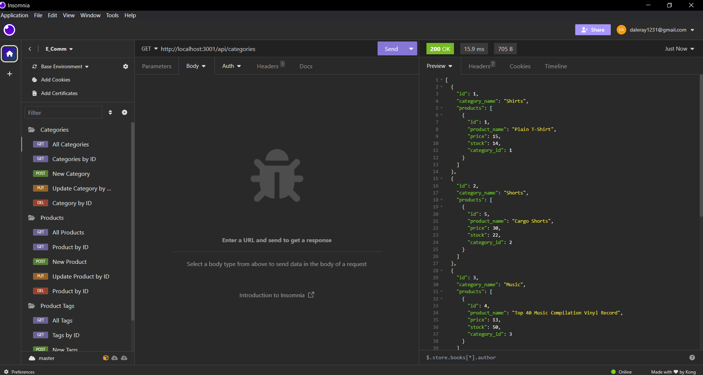

# Simple E-commerce Backend



## Table of Contents
- [About](#about)
  - [Why I did this?](#why-i-did-this)
  - [What it tackles?](#what-it-tackles)
  - [Key Takeaways](#key-takeaways)
- [Setup Guide](#setup-guide)
- [How to Use](#how-to-use)
- [Tech Used](#tech-used)
- [Credits](#credits)
- [Contributing](#contributing)
- [Testing](#testing)

## About

This project serves as the backbone of an online store, providing a robust backend crucial for any e-commerce business.

### Why I did this?
To practice ORM, work with Sequelize, and prepare for a backend development career.

### What it tackles?
It offers an API for an e-commerce platform's backend.

### Key Takeaways
Setting up a Sequelize project, integrating it into an Express.js API, and creating different types of API routes.

## Setup Guide

1. Clone this GitHub repository: [CLONE ME](https://github.com/Daleray1231/E_Comm)
   
2. Navigate to the project folder in your terminal and install required npm packages:
```bash
 cd <Your-Project-Directory>
 npm install express sequelize mysql2 dotenv
 npm install --save-dev jest
```

3. Create a .env file in the root directory for your MySQL username, password, and database name:
```bash
.env
Copy code
DB_NAME='your_database_name'
DB_USER='your_username'
DB_PASS='your_password'
```

4. Run this command to seed your MySQL database:

```bash
npm run seed
```

5. Start the Express.js server with this command:
```bash
npm start
```

## How to Use
Use tools like Insomnia Core to test the API endpoints.  
The API enables you to manage Categories, Products, and Tags with functions like fetching, creating, updating, and deleting.

## E-commerce Backend Demo

[Demo Video](https://share.vidyard.com/watch/zKe7kDWXtUUoc9QourEKUB?)

## Tech Used
- Sequelize
- MySQL2
- Express.js
- Dotenv

## Credits
University of Texas at Austin Coding Bootcamp
License
MIT

## Contributing
Fork the project and submit your changes via pull request.

## Testing
Run npm run seed to fill the database with test data.
Use Insomnia Core to test all API routes.

